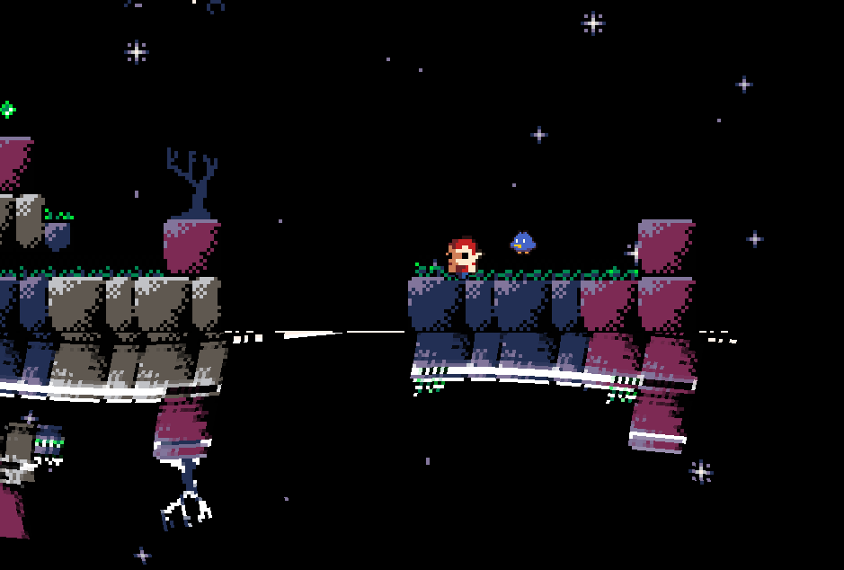
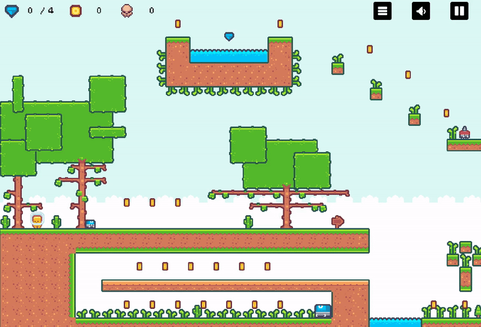

<h1 style="text-align: center;">
    Software Engineer · Automation-First Builder · No-Code & Custom Systems
</h1>

    I design and build pragmatic systems — from rapid no-code products to
    fully custom applications when control, performance, and ownership matter.
      
    I focus on shipping fast, automating repetitive work, and hardening what
    proves valuable.

<h2>🛠 What I Build</h2>
<ul>
    <li>End-to-end platforms (portals, HR systems, CRMs, ERPs)</li>
    <li>Web applications and internal tools</li>
    <li>Automation-heavy systems and integrations</li>
    <li>Desktop applications</li>
    <li>Mobile applications (iOS & Android)</li>
    <li>Custom extensions, plugins, and experimental projects</li>
</ul>

<h2>🧠 How I Work</h2>
<ul>
    <li>No-code first, code when necessary</li>
    <li>Ship fast, then harden</li>
    <li>Automation over repetition</li>
    <li>Simple systems beat clever ones</li>
    <li>Production-minded: maintainability, observability, and cost awareness</li>
</ul>

<h2>🧩 No-Code & Automation Stack</h2>

    Product acceleration, workflow orchestration, and low-ops delivery.

    <!-- Automation -->
    
    
    
    
    
    
    
    

<h2>⚙️ Classic Development Stack</h2>

    When flexibility, performance, or ownership are non-negotiable.

    <!-- Databases -->
    
    
    
    
    
    
    
    
    
    

<h2>🎮 Game & Creative Tech</h2>

    Built for experimentation, mechanics, and fun.

    
    

    
    

